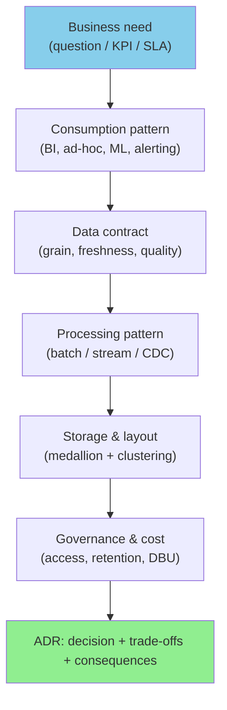
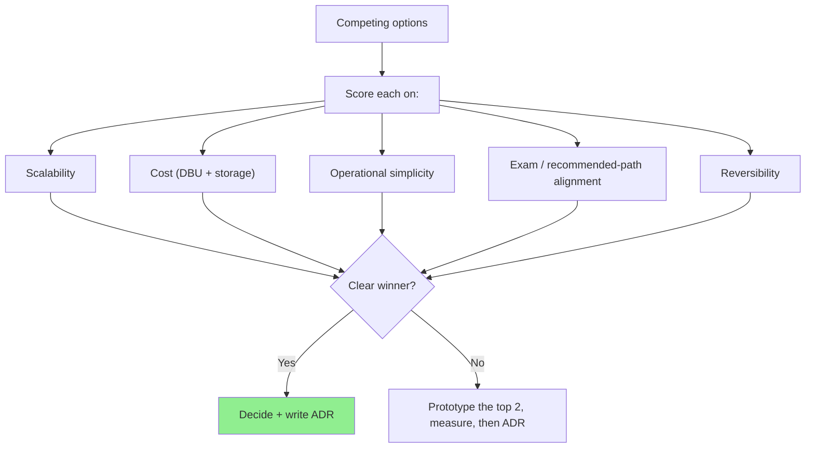
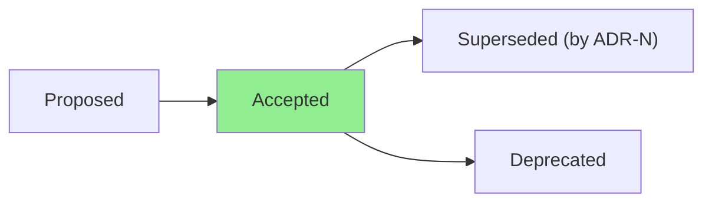
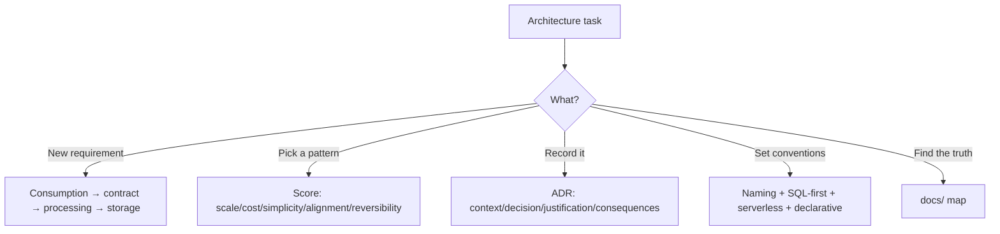

# Databricks Architecture Standards & Technical Reference

## Overview

This skill covers **defining and evolving corporate data architecture** and **acting as a
technical reference** — establishing standards and best practices for storage, processing,
and consumption of data, and translating business needs into scalable, sustainable
solutions. It is the meta-skill that decides *which* pattern the other skills apply, and
records *why* via **Architecture Decision Records (ADRs)**.

It sits above the delivery skills:
`data-engineering-pipelines`, `data-governance-quality`,
`performance-cost-optimization`, `devops-observability`, and `medallion-architecture`.

## When to Use This Skill

- **"Which pattern should we standardize on for X?"** — decision frameworks & matrices
- **"How do I document an architecture decision?"** — ADR structure & lifecycle
- **"How do I turn a business requirement into a data solution?"** — requirement → architecture mapping
- **"What conventions should the team follow?"** — naming, layering, SQL-first standards
- **"How do I evaluate a trade-off (cost vs latency vs complexity)?"** — evaluation rubric
- **"Where is the source of truth for this decision?"** — documentation map

## From Business Need to Architecture

Work **right-to-left from consumption**: the way data is consumed dictates the Gold shape,
which dictates Silver contracts, which dictates ingestion and storage. Avoid designing
bottom-up from the source and hoping it fits the question.

## Standardization Principles (this project)

- **Serverless-first** — design within the serverless model (no cluster tuning); let the
  platform manage compute. Portable to Free Edition and beyond.
- **Declarative over imperative** — SDP + AUTO CDC + expectations over hand-written
  MERGE/state loops, unless a scenario is outside SDP.
- **SQL where possible, Python where necessary** — matches the exam rule and lowers the
  maintenance bar for a mixed team.
- **One pipeline, three layers** — a single SDP pipeline publishes Bronze/Silver/Gold via
  fully-qualified names + `${...}` parameters, rather than three disjoint pipelines.
- **Immutable Bronze, resolved Silver** — duplicates are expected in Bronze (auditable) and
  resolved declaratively in Silver.
- **Config as variables** — catalog/schema/series parameterized; never hardcoded.
- **Testable pure functions** — business logic in `lib/`, Spark in thin wrappers.

## Naming & Convention Standards

| Aspect | Standard |
|--------|----------|
| Schemas | `bcb_dev_{bronze\|silver\|gold}` (dev) / `bcb_{...}` (prod) via `env_prefix` |
| Tables / columns | pt-BR `snake_case` |
| Technical columns | prefix `_` (`_ingerido_em`, `_rescued_data`, `_arquivo_origem`) |
| Language of code | SQL preferred; Python when needed |
| Commits | Conventional Commits |

## Decision Framework

### Reference decisions in this architecture

| Decision | Chosen | Over | Why (short) |
|----------|--------|------|-------------|
| Bronze ingestion | Auto Loader (`STREAM read_files`) | COPY INTO / CTAS | Checkpoint scale, schema evolution, `_rescued_data`, inherits SDP retries/event log (ADR-001) |
| Dedup / dimensions | AUTO CDC SCD1/SCD2 | MERGE in notebook | Late-arrival ordering, no hand-written state, generates `__START_AT`/`__END_AT` (ADR-002) |
| Pipeline topology | One SDP → 3 layers | 3 separate pipelines | Fully-qualified names + `${...}` params; single lineage/event log |
| Compute | Serverless | Classic clusters | Free Edition constraint; platform-managed tuning |

## ADR Lifecycle

An ADR captures **Context → Decision → Justification → Consequences**. It is short,
dated, immutable once accepted (supersede rather than edit), and lives in `docs/ADR-*.md`.
Consequences must state constraints the decision imposes on future code — e.g. "AUTO CDC
targets receive no manual DML," "landing zone is the full-refresh source of truth."

See `templates/adr-template.md`.

## Documentation Map (source of truth)

| Concern | Location |
|---------|----------|
| Decisions & trade-offs | `docs/ADR-*.md` |
| Per-layer contracts | `docs/data-contracts.md` |
| Operation & troubleshooting | `docs/runbook.md` |
| Phases & advancement criteria | `docs/ROADMAP.md` |
| Product/requirements | `docs/PRD.md` |
| Agent guidance | `CLAUDE.md` (root) |

Keep `docs/` as the source of truth; replicate any edit into mirrored copies where they exist.

## Common Mistakes

| Mistake | Impact | Fix |
|---------|--------|-----|
| Designing bottom-up from the source | Gold doesn't answer the business question | Work right-to-left from consumption |
| Undocumented decisions | Re-litigated later; tribal knowledge | Write an ADR with consequences |
| Editing an accepted ADR | Loses decision history | Supersede with a new ADR |
| Hardcoding environment specifics | Not portable dev→prod | Parameterize via variables |
| Imperative where declarative fits | More code, more bugs | SDP/AUTO CDC/expectations first |
| Standard without rationale | Not adopted by the team | Tie each standard to a "why" |

## Quick Reference

## Version History

- **v1.0.0** — Business-need→architecture mapping, standardization principles, naming
  conventions, decision framework + reference decisions, ADR lifecycle, documentation map.
