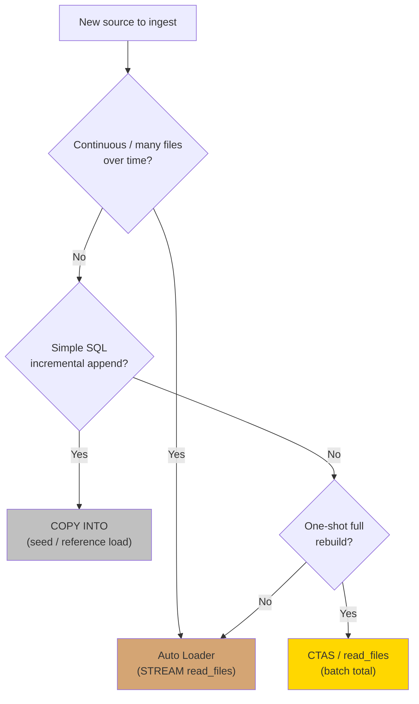
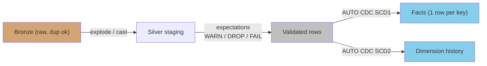
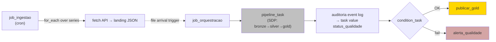
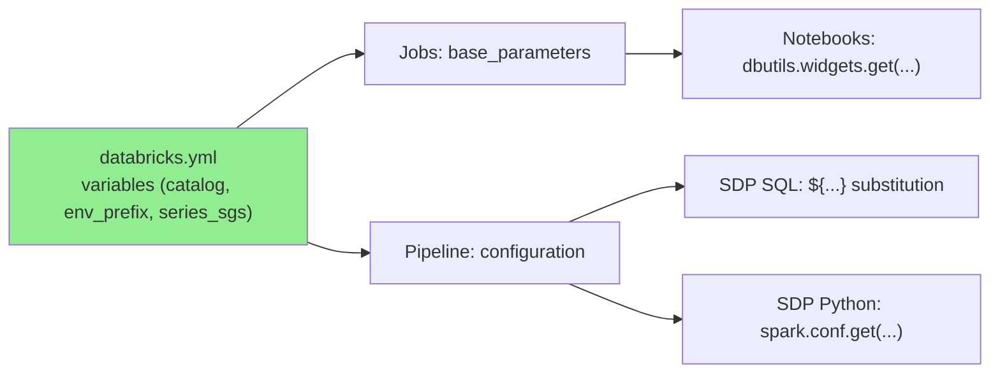
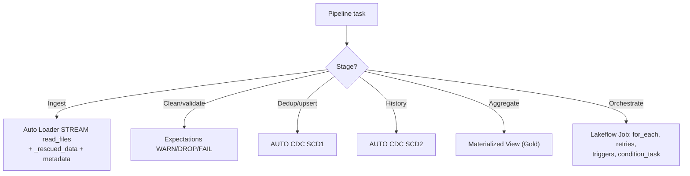

# Databricks Data Engineering Pipelines

## Overview

This skill covers the end-to-end construction of data pipelines on Databricks:
**ingestion → transformation → delivery**. It maps the corporate data-engineering
responsibility of building and maintaining pipelines that feed different areas of the
organization, with an emphasis on **Lakeflow** — the declarative pipeline (SDP), Jobs,
and Auto Loader stack that is the recommended path on modern Databricks and on the
Free Edition (serverless-only).

Three delivery vehicles work together:

- **Auto Loader** (`STREAM read_files` / `cloudFiles`) — incremental, checkpointed ingestion.
- **Spark Declarative Pipelines (SDP)** — declarative transformation with data quality (expectations) and change data capture (AUTO CDC).
- **Lakeflow Jobs** — orchestration: DAGs, `for_each`, retries, triggers, conditional branching.

## When to Use This Skill

- **"How do I ingest data from an API / file drop / database into the lakehouse?"** — ingestion pattern selection
- **"Should I use CTAS, COPY INTO, or Auto Loader?"** — ingestion decision matrix
- **"How do I deduplicate or upsert incrementally?"** — AUTO CDC vs MERGE
- **"How do I track history of a dimension?"** — SCD Type 1 / Type 2 patterns
- **"How do I orchestrate a multi-step pipeline with retries and conditional paths?"** — Lakeflow Jobs DAG design
- **"How do I trigger a pipeline when a new file lands?"** — file-arrival / table-update triggers
- **"How do I pass parameters through jobs and pipelines?"** — parameter-flow pattern

## Ingestion: Choosing a Pattern



| Method | Incremental | Checkpoint | Schema evolution | Best for |
|--------|-------------|------------|------------------|----------|
| **Auto Loader** | ✅ | ✅ (RocksDB) | ✅ native + `_rescued_data` | Ongoing file ingestion at scale |
| **COPY INTO** | ✅ (idempotent) | ✅ (tracked files) | limited | Simple reference/seed loads |
| **CTAS / read_files** | ❌ | ❌ | inference only | One-off full rebuild |

**Why Auto Loader as the Bronze default:** file discovery via checkpoint (no full re-list each run), native schema inference/evolution, and — inside SDP — it inherits retries, event log, and expectations. Duplicates in Bronze are expected (source moving window) and are resolved in Silver.

### Auto Loader in SDP (Bronze)

```python
import dlt
from pyspark.sql.functions import col, current_timestamp

@dlt.table(
    name="bronze_sgs",
    comment="Raw SGS series landed as JSON — immutable, auditable",
)
def bronze_sgs():
    return (
        spark.readStream.format("cloudFiles")
        .option("cloudFiles.format", "json")
        .option("cloudFiles.inferColumnTypes", "true")
        .option("cloudFiles.schemaEvolutionMode", "addNewColumns")
        .option("rescuedDataColumn", "_rescued_data")
        .load(spark.conf.get("landing_path"))
        .select(
            "*",
            col("_metadata.file_path").alias("_arquivo_origem"),
            current_timestamp().alias("_ingerido_em"),
        )
    )
```

> `addNewColumns` fails the stream on the first occurrence of a new column and resumes
> after restart — handle this with **job retries**, not manual intervention.

## Transformation: Silver with Expectations + CDC

Silver applies quality gates and resolves duplicates declaratively.



### Expectations (3 modes)

| Mode | Directive | Effect on violating rows |
|------|-----------|--------------------------|
| **WARN** | `EXPECT` | Kept; counted in event log |
| **DROP** | `EXPECT ... ON VIOLATION DROP ROW` | Dropped; counted |
| **FAIL** | `EXPECT ... ON VIOLATION FAIL UPDATE` | Update fails immediately |

```sql
CREATE OR REFRESH STREAMING TABLE silver_sgs (
  CONSTRAINT valor_nao_nulo   EXPECT (valor IS NOT NULL) ON VIOLATION DROP ROW,
  CONSTRAINT data_valida      EXPECT (data_ref <= current_date()),
  CONSTRAINT serie_conhecida  EXPECT (codigo_serie IN (${series_sgs})) ON VIOLATION FAIL UPDATE
)
AS SELECT
  cast(codigo_serie AS INT)        AS codigo_serie,
  to_date(data, 'dd/MM/yyyy')      AS data_ref,
  cast(valor AS DOUBLE)            AS valor,
  _ingerido_em
FROM STREAM(bronze_sgs);
```

### Deduplication / upsert: AUTO CDC over MERGE

Prefer **AUTO CDC** (declarative, successor of `APPLY CHANGES`) for dedup and dimensions.
It applies events in `SEQUENCE BY` order even when they arrive late, and generates
`__START_AT`/`__END_AT` correctly for SCD2 — eliminating error-prone hand-written state logic.

```sql
-- SCD Type 1: one row per (série, data) — highest _ingerido_em wins
CREATE OR REFRESH STREAMING TABLE fato_sgs;

APPLY CHANGES INTO live.fato_sgs
FROM STREAM(live.silver_sgs)
KEYS (codigo_serie, data_ref)
SEQUENCE BY _ingerido_em
STORED AS SCD TYPE 1;

-- SCD Type 2: customer history, honoring deletes
CREATE OR REFRESH STREAMING TABLE clientes_scd2;

APPLY CHANGES INTO live.clientes_scd2
FROM STREAM(live.silver_clientes)
KEYS (cliente_id)
APPLY AS DELETE WHEN operacao = 'DELETE'
SEQUENCE BY _ingerido_em
STORED AS SCD TYPE 2;
```

**Critical constraints:**
- Tables targeted by AUTO CDC are pipeline-managed — **never apply manual DML** to them.
- The `SEQUENCE BY` tie-breaker must be **monotonic per key** (e.g. an ingestion timestamp).
- Keep a MERGE-based version as reference material for non-SDP scenarios and exam fundamentals.

### MERGE (didactic / non-SDP fallback)

```python
from delta.tables import DeltaTable

alvo = DeltaTable.forName(spark, "silver.fato_sgs")
(alvo.alias("t")
   .merge(fonte_dedup.alias("s"), "t.codigo_serie = s.codigo_serie AND t.data_ref = s.data_ref")
   .whenMatchedUpdateAll()
   .whenNotMatchedInsertAll()
   .execute())
```

> The source **must be deduplicated before** the MERGE — otherwise multiple source rows
> matching one target row raise an error. This is why AUTO CDC (which dedups via sequence)
> is preferred.

## Orchestration: Lakeflow Jobs



Key job building blocks:

- **`for_each_task`** — fan out over a list (e.g. one ingestion task per SGS series).
- **retries** — absorb transient API failures and schema-evolution restarts.
- **triggers** — `cron` for ingestion; **file arrival** to start orchestration when JSON lands; **table update** as an alternative.
- **`condition_task`** — branch on a task value (e.g. quality status) to `publicar_gold` vs `alerta_qualidade`.
- **repair run** — re-execute only the failed task without rerunning the whole DAG.

### Publishing task values for conditional branching

```python
# 06_auditoria_qualidade.py — read the pipeline event log, publish a decision
status = "OK" if falhas_criticas == 0 else "FAIL"
dbutils.jobs.taskValues.set(key="status_qualidade", value=status)
```

```yaml
# resources/job_orquestracao.yml (excerpt)
- task_key: verificar_qualidade
  condition_task:
    op: EQUAL_TO
    left: "{{tasks.auditoria.values.status_qualidade}}"
    right: "OK"
```

## Parameter-Flow Pattern (transversal)

Parameters flow the same way through the whole stack — learn it once, apply everywhere:



```python
# Notebook side
catalog = dbutils.widgets.get("catalog")
env_prefix = dbutils.widgets.get("env_prefix")
```

```sql
-- SDP SQL side
CREATE OR REFRESH STREAMING TABLE ${catalog}.${env_prefix}_silver.silver_sgs ...
```

## Serverless Constraints (Free Edition)

- No classic clusters → **no cluster config, no cluster libraries**; most `spark.conf.set` tuning calls fail (expected — the platform manages them).
- No external locations → **external tables** are conceptual/demo only; use managed tables.
- The **landing zone is the source of truth** for full refresh — never delete files from it.

## Common Mistakes

| Mistake | Impact | Fix |
|---------|--------|-----|
| Manual DML on AUTO CDC target | Corrupts pipeline-managed state | Only the pipeline writes; change the source |
| MERGE with non-deduplicated source | Runtime error / wrong results | Dedup source first, or use AUTO CDC |
| Non-monotonic `SEQUENCE BY` key | Wrong "latest" wins | Use an ingestion timestamp monotonic per key |
| Deleting landing files after load | Breaks full refresh / replay | Retention only; landing is immutable truth |
| Transforming in Bronze | Loses raw audit trail | Keep Bronze raw; transform in Silver |
| Expecting `spark.conf.set` tuning to apply | Silent no-op / error on serverless | Rely on AQE + platform defaults |

## Quick Reference



## Version History

- **v1.0.0** — Ingestion decision matrix, Auto Loader/SDP patterns, expectations, AUTO CDC SCD1/SCD2, Lakeflow Jobs orchestration, parameter-flow, serverless constraints.
