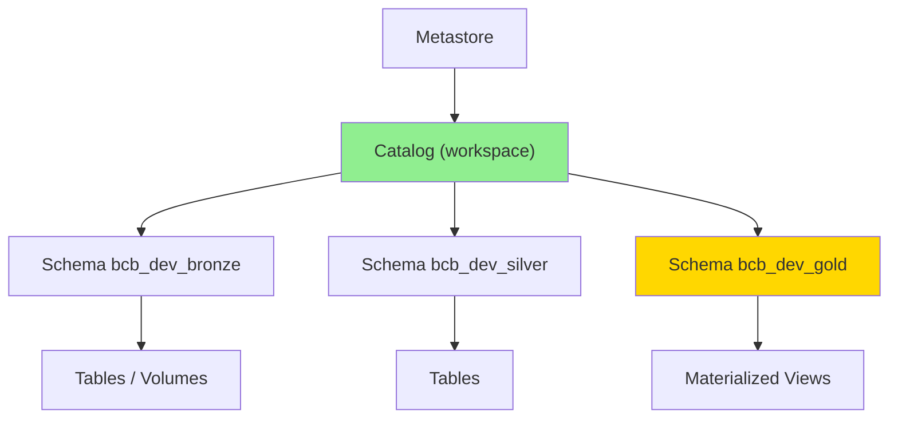
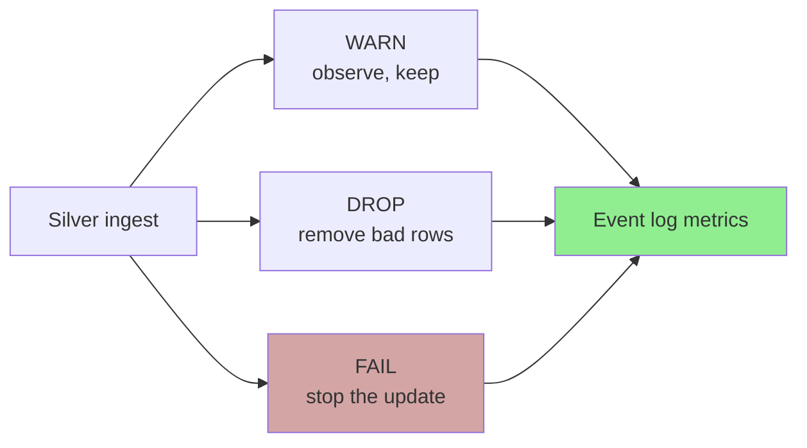
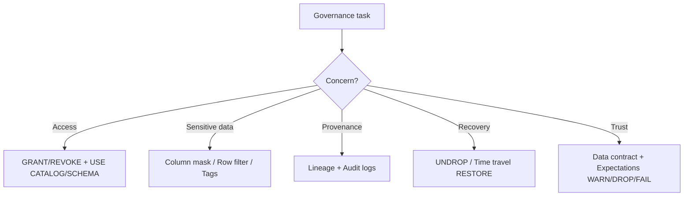

# Databricks Data Governance & Quality

## Overview

This skill covers **governance, quality, security, and traceability** of data on
Databricks — the corporate responsibility of guaranteeing that data is trustworthy,
traceable, governed, and secure per organizational policy. It is anchored in
**Unity Catalog** (UC) and the SDP **expectations** framework.

Two complementary axes:

- **Governance & security** — who can access what (grants/RBAC), how sensitive data is
  protected (row filters, column masks, tags/ABAC), how provenance is tracked (lineage,
  audit logs), and how to recover (UNDROP, time travel).
- **Quality** — enforceable contracts per layer and expectations (WARN/DROP/FAIL) that
  surface violations in the pipeline event log.

## When to Use This Skill

- **"How do I grant/revoke access to a schema or table?"** — UC grants & the RBAC model
- **"How do I protect PII / mask a column / filter rows per user?"** — column masks, row filters
- **"How do I classify and discover sensitive data?"** — tags / ABAC
- **"How do I see where a table came from / who touched it?"** — lineage & audit logs
- **"I dropped a table by mistake — can I recover it?"** — UNDROP & time travel
- **"How do I enforce data quality in the pipeline?"** — expectations & data contracts
- **"Why is there no DENY in Unity Catalog?"** — UC privilege model

## Unity Catalog Object Model & Privilege Flow



Key facts:
- Privileges are **hierarchical**: a grant at catalog/schema level cascades to children.
- UC has **no DENY** — access is purely additive via GRANT; you remove access with REVOKE.
  There is no explicit deny that overrides a grant. Design by granting the minimum.
- `USE CATALOG` + `USE SCHEMA` are required to traverse to an object before `SELECT` works.

## RBAC by Medallion Layer

```text
Bronze (raw, auditable):
  ├─ Data Engineers        → READ/WRITE via pipeline identity
  └─ Analysts              → no grant (confidential raw)

Silver (validated, shared):
  ├─ Data Engineers        → READ/WRITE
  ├─ Analytics Engineers   → READ/WRITE
  └─ Domain teams          → SELECT on their schema only

Gold (business-ready):
  ├─ BI service account    → SELECT
  ├─ Analysts              → SELECT (with row filter where needed)
  └─ Data stewards         → MANAGE
```

```sql
-- Traverse + read grant (Free Edition: demo against `account users`)
GRANT USE CATALOG ON CATALOG workspace TO `account users`;
GRANT USE SCHEMA  ON SCHEMA  workspace.bcb_gold TO `account users`;
GRANT SELECT      ON SCHEMA  workspace.bcb_gold TO `account users`;

-- Inspect and revoke
SHOW GRANTS ON SCHEMA workspace.bcb_gold;
REVOKE SELECT ON SCHEMA workspace.bcb_gold FROM `account users`;
SHOW GRANTS ON SCHEMA workspace.bcb_gold;   -- confirm removal
```

## Protecting Sensitive Data

### Column mask

```sql
CREATE OR REPLACE FUNCTION workspace.bcb_gold.mascarar_cpf(cpf STRING)
RETURN CASE
  WHEN is_account_group_member('auditores') THEN cpf
  ELSE concat('***.***.***-', substr(cpf, -2))
END;

ALTER TABLE workspace.bcb_gold.dim_clientes
  ALTER COLUMN cpf SET MASK workspace.bcb_gold.mascarar_cpf;
```

### Row filter

```sql
CREATE OR REPLACE FUNCTION workspace.bcb_gold.filtro_regiao(regiao STRING)
RETURN is_account_group_member('admin') OR regiao = current_user_region();

ALTER TABLE workspace.bcb_gold.fato_indicadores
  SET ROW FILTER workspace.bcb_gold.filtro_regiao ON (regiao);
```

### Tags / ABAC (classification)

```sql
ALTER TABLE workspace.bcb_silver.silver_clientes
  ALTER COLUMN cpf SET TAGS ('pii' = 'true', 'sensitivity' = 'confidential');
```

Tags feed attribute-based access control and data discovery. Use a consistent
vocabulary: `pii`, `sensitivity` (public/internal/confidential), `domain`.

## Lineage, Audit & Recovery

- **Lineage** — UC captures table- and column-level lineage automatically; inspect it in
  Catalog Explorer to trace `gold ← silver ← bronze ← source`.
- **Audit logs** — record who accessed which object and when (JSON delivery, some latency).
- **UNDROP** — recover a recently dropped managed table:
  ```sql
  UNDROP TABLE workspace.bcb_silver.silver_sgs;
  ```
- **Time travel** — audit or restore prior state:
  ```sql
  SELECT * FROM workspace.bcb_bronze.bronze_sgs VERSION AS OF 12;
  RESTORE TABLE workspace.bcb_bronze.bronze_sgs TO VERSION AS OF 12;
  ```

## Data Quality: Contracts + Expectations

Quality is enforced at the layer boundary. Define a **data contract** per layer
(schema, keys, nullability, allowed ranges) and back it with SDP **expectations**.



| Layer | Contract focus | Typical expectation mode |
|-------|----------------|--------------------------|
| Bronze | Landed, raw, `_rescued_data` populated | none (immutable) |
| Silver | Types, nullability, referential ranges, keys | WARN / DROP / FAIL |
| Gold | Measure reconciliation, freshness/SLA | WARN + monitoring |

```sql
CREATE OR REFRESH STREAMING TABLE silver_sgs (
  CONSTRAINT valor_presente   EXPECT (valor IS NOT NULL) ON VIOLATION DROP ROW,
  CONSTRAINT data_no_passado  EXPECT (data_ref <= current_date()),
  CONSTRAINT serie_valida     EXPECT (codigo_serie > 0) ON VIOLATION FAIL UPDATE
) AS SELECT ... FROM STREAM(bronze_sgs);
```

**Auditing quality:** read the pipeline **event log** (`event_type = 'flow_progress'`,
`data_quality` payload) to count passing/failing rows per expectation, publish a
`status_qualidade` task value, and branch the job (`publicar_gold` vs `alerta_qualidade`).

## Free Edition Notes

- Single-user workspace → grants are demonstrated against the `account users` group.
- No external locations → **managed vs external** tables are covered conceptually; all
  real tables are managed.

## Common Mistakes

| Mistake | Impact | Fix |
|---------|--------|-----|
| Expecting DENY to block a grant | UC has no DENY | Grant least privilege; REVOKE to remove |
| Granting SELECT without USE CATALOG/SCHEMA | User still can't read | Grant the traversal privileges too |
| PII stored/served in clear text | Compliance risk | Column mask + tags + restricted grants |
| No quality gate before Gold | Bad data reaches dashboards | Expectations + condition_task branch |
| Manually dropping a pipeline table | Breaks lineage/managed state | Recover via UNDROP; let pipeline manage |

## Quick Reference



## Version History

- **v1.0.0** — UC privilege model & RBAC by layer, column masks/row filters/tags,
  lineage/audit/UNDROP/time-travel, data contracts + expectations, Free Edition notes.
