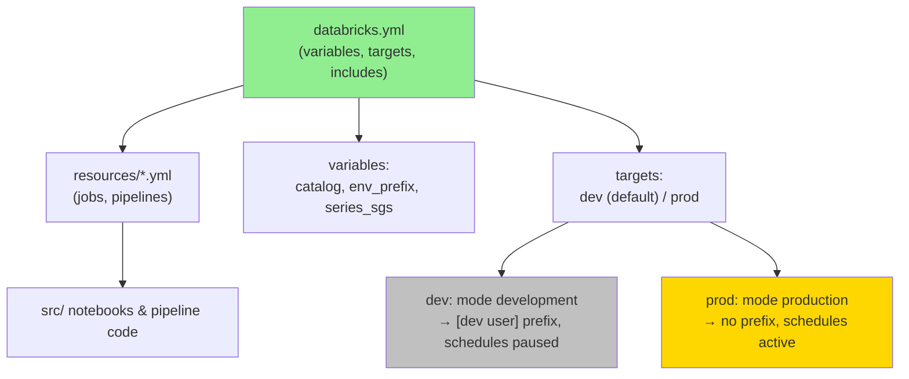
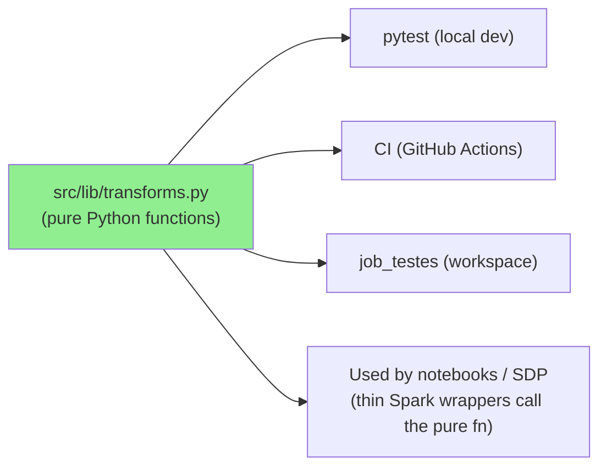
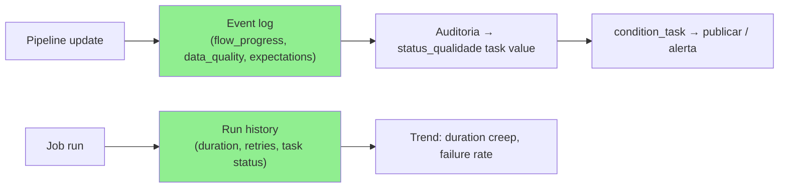
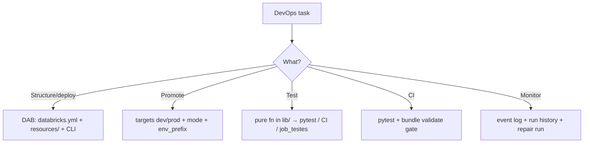

# Databricks DevOps & Observability

## Overview

This skill covers **standardization, deployment, testing, and observability** — the
corporate responsibility of defining development, documentation, monitoring, and
observability standards for data solutions. The backbone is **Databricks Asset Bundles
(DAB)** for infrastructure-as-code, the **Databricks CLI** for lifecycle operations,
**pytest + CI** for correctness, and the **event log / run history** for observability.

## When to Use This Skill

- **"How do I structure a deployable Databricks project?"** — DAB layout & `databricks.yml`
- **"How do I promote from dev to prod safely?"** — targets, `mode`, environment isolation
- **"How do I parameterize per environment?"** — variables & overrides
- **"How do I test Spark logic without a cluster?"** — pure-function pattern + pytest
- **"How do I set up CI?"** — GitHub Actions: pytest + `bundle validate`
- **"How do I know a pipeline/job succeeded and stayed healthy?"** — event log & run history
- **"How do I re-run only the failed part of a job?"** — repair run

## Asset Bundle Anatomy



```yaml
# databricks.yml (excerpt)
bundle:
  name: bcb-lakehouse-lab

variables:
  catalog:    { default: workspace }
  env_prefix: { default: bcb_dev }
  series_sgs: { default: '[433, 189, 4390]' }

include:
  - resources/*.yml

targets:
  dev:
    mode: development     # prefixes [dev <user>], pauses schedules/triggers
    default: true
  prod:
    mode: production
    variables:
      env_prefix: bcb     # override: prod schemas drop the _dev
```

### Environment isolation (Free Edition: one catalog)

Same catalog `workspace`, separated by **schema prefix** via `env_prefix`:
`bcb_dev_{bronze|silver|gold}` (dev) vs `bcb_{...}` (prod). `mode: development` additionally
prefixes resource names with `[dev <user>]` and **pauses schedules/triggers** so dev work
never fires production automation.

## CLI Lifecycle

```bash
databricks bundle validate            # lint config (schema + references)
databricks bundle deploy -t dev       # deploy to dev (default target)
databricks bundle run job_setup -t dev        # one-time: schemas/volumes
databricks bundle run job_ingestao -t dev     # trigger a job
databricks bundle deploy -t prod      # promote to prod (compare isolation)
```

`bundle validate` catches variable/override and reference errors before deploy — run it in
CI and locally before every deploy.

## Testable-by-Design: Pure Functions

Business logic lives as **pure functions** (no Spark session) in `src/lib/transforms.py`,
so it runs identically in three places: **pytest locally**, **CI**, and **in-workspace via
`job_testes`**. New logic follows this pattern.



```python
# src/lib/transforms.py — pure, Spark-free
def para_data_sgs(valor: str) -> str:
    """'01/07/2026' -> '2026-07-01'."""
    d, m, a = valor.split("/")
    return f"{a}-{m}-{d}"
```

```python
# tests/test_transforms.py
from src.lib.transforms import para_data_sgs

def test_para_data_sgs():
    assert para_data_sgs("01/07/2026") == "2026-07-01"
```

```bash
pytest tests/ -v                                          # all tests
pytest tests/test_transforms.py::test_para_data_sgs -v    # a single test
```

> Keep Spark out of `lib/` — the notebook/SDP layer is a thin wrapper that calls the pure
> function. This is what makes the logic testable without a cluster.

## CI/CD

```yaml
# .github/workflows/ci.yml (shape)
jobs:
  test:
    steps:
      - run: pip install -r requirements-dev.txt
      - run: pytest tests/ -v
      - run: databricks bundle validate    # needs DATABRICKS_HOST / DATABRICKS_TOKEN secrets
```

Gate merges on: **pytest green** + **`bundle validate` clean**. Promote to prod only from a
validated main. Practice PRs via **Git Folders** in the workspace.

## Observability



- **Event log** — the SDP source of truth for update health and data-quality metrics
  (rows passed/dropped/failed per expectation). Query it to audit quality.
- **Run history** — per-task status, duration, retries; watch trends for regressions.
- **Repair run** — after fixing a failure, re-execute **only the failed task(s)** instead
  of the whole DAG.
- **Alerting** — a failed quality gate branches to `alerta_qualidade` (notify), keeping the
  monitoring signal inside the orchestration.

## Common Mistakes

| Mistake | Impact | Fix |
|---------|--------|-----|
| Testing logic that requires Spark | Slow, can't run in CI | Extract pure function to `lib/`, test that |
| Deploying without `bundle validate` | Broken config reaches workspace | Validate in CI + pre-deploy |
| Hardcoding catalog/schema | Can't promote dev→prod | Use variables + `env_prefix` overrides |
| Running dev job that fires prod schedule | Accidental production side effects | `mode: development` pauses schedules |
| Re-running whole job after one failure | Wasted compute/time | Repair run on the failed task |
| Ignoring the event log | Silent quality degradation | Audit event log; publish status task value |

## Quick Reference



## Version History

- **v1.0.0** — DAB anatomy & targets, environment isolation, CLI lifecycle, pure-function
  testing pattern, CI/CD gating, event-log/run-history observability, repair run.
