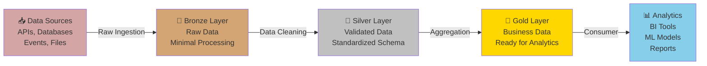
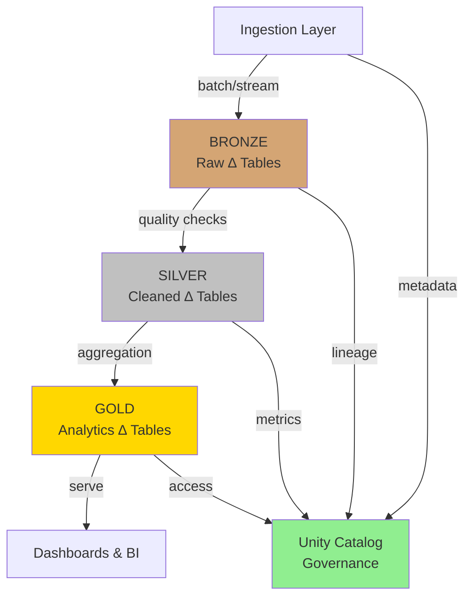
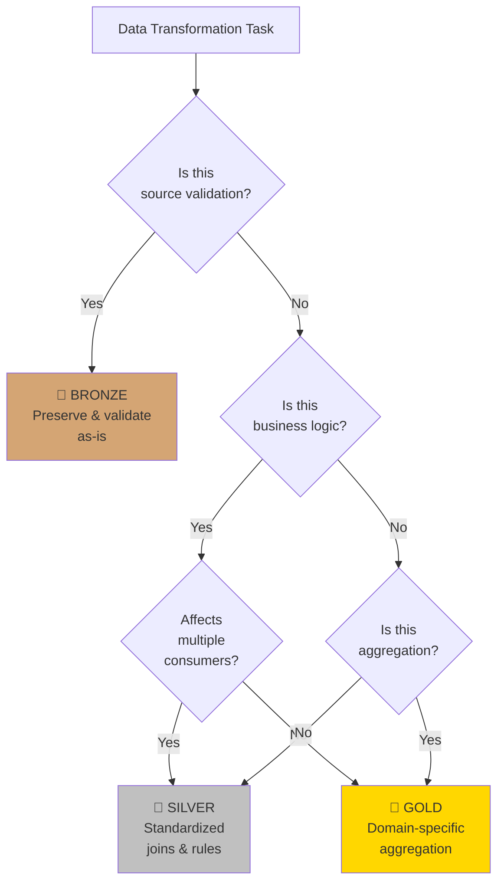
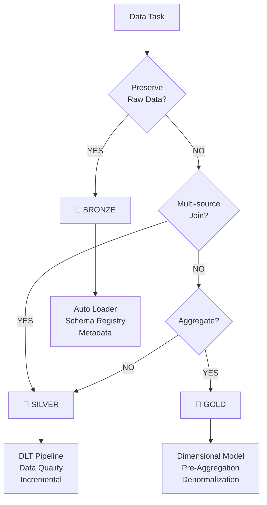

# Databricks Medallion Architecture

## Overview

The medallion architecture (also called the "bronze-silver-gold" architecture) is a layered data organization pattern on Databricks that provides a structured, scalable approach to building modern data platforms. Each layer serves a specific purpose in the data pipeline:

- **Bronze Layer** — Raw data ingestion with minimal transformation
- **Silver Layer** — Cleaned, validated, and deduplicated data
- **Gold Layer** — Aggregated, business-ready data for analytics and reporting

This skill teaches data engineers how to design and implement medallion patterns on Databricks using Delta Lake, with emphasis on architecture decisions, data governance, and cost optimization.

## When to Use This Skill

Trigger this skill when you encounter these scenarios:

- **"How should I organize my data lakehouse on Databricks?"** — Use for medallion layer design and folder structure decisions
- **"What transformations belong in bronze vs. silver vs. gold?"** — Use for transformation responsibility mapping
- **"How do I set up data governance for a medallion architecture?"** — Use for RBAC, lineage, and compliance patterns
- **"What's the best way to handle real-time + batch data?"** — Use for hybrid ingestion patterns
- **"How can I optimize costs in my data platform?"** — Use for retention, partitioning, and compaction strategies
- **"Should I denormalize data or keep it normalized?"** — Use for schema design decision trees
- **"How do I handle incremental data processing?"** — Use for Delta Lake incremental patterns

## Core Concepts

### Medallion Architecture Overview



### Layer Responsibilities

#### Bronze Layer — Raw Ingestion

**Purpose:** Preserve data in its original form with minimal transformation  
**Goal:** Speed and reliability of data capture

**Characteristics:**
- Schema as provided by source
- Minimal transformations (format conversion only)
- Include metadata (ingestion timestamp, source system, data quality flags)
- Store historical changes (slowly changing dimensions)
- May contain duplicates, nulls, and data quality issues

**Decision: When to use Bronze layer:**
- All external data sources land here first
- Preserve audit trail and historical versions
- Decouple ingestion from transformation (separation of concerns)
- Enable replay and recovery

#### Silver Layer — Validated & Standardized

**Purpose:** Transform and validate data for enterprise use  
**Goal:** Quality and consistency

**Characteristics:**
- Deduplicated records
- Standardized schemas (naming conventions, data types)
- Data quality checks applied
- Sensitive data masked or tokenized
- Join key relationships established
- Incremental processing (only new/changed records)

**Decision: When to use Silver layer:**
- Join multiple bronze tables (customer + orders)
- Apply business rules and domain logic
- Enforce data contracts
- Create slowly changing dimensions (SCD Type 2)

#### Gold Layer — Business Analytics

**Purpose:** Aggregated, denormalized data for reporting  
**Goal:** Performance and analytics speed

**Characteristics:**
- Pre-aggregated measures (daily, hourly)
- Denormalized for query performance
- Domain-specific star schemas (facts + dimensions)
- One version of truth (SSOT)
- Optimized for BI tool consumption

**Decision: When to use Gold layer:**
- Pre-compute expensive aggregations
- Maintain single source of truth for metrics
- Optimize query performance for dashboards
- Support self-service analytics

### Data Flow Architecture



### Transform Responsibility Decision Tree



## Design Patterns Workflow

### Pattern 1: Real-Time + Batch Hybrid Ingestion

**When to use:** Streaming events (real-time) + daily batch files (historical data)

**Pattern:**
```text
Event Stream → Kafka → Bronze (real-time)
              ↓
         Microservices
              ↓
         Daily CSV → Bronze (batch)
              ↓
         Silver: Unified schema
              ↓
         Gold: Combined metrics
```

**Implementation approach:**
- Use `MERGE INTO` for incremental updates
- Auto Loader for reliable file ingestion
- Structured Streaming for real-time ingestion
- Separate Bronze tables for each source (easier troubleshooting)

---

### Pattern 2: Data Quality & Validation

**When to use:** Ensuring data trustworthiness before analytics consumption

**Quality checks at each layer:**

| Layer | Quality Checks | Action |
|-------|---|---|
| **Bronze** | Schema validation, row counts, nullability | Quarantine + alert if invalid |
| **Silver** | Duplicate detection, referential integrity, range checks | Reject invalid; flag for review |
| **Gold** | Measure reconciliation, SLA compliance | Monitor + notify |

**Implementation approach:**
- Use Databricks Lakehouse Monitoring for auto data profiling
- Implement Great Expectations or custom quality checks
- Quarantine tables for failed records (debugging + replay)
- Data quality dashboard (metrics per table/date)

---

### Pattern 3: Multi-Tenant Data Isolation

**When to use:** SaaS platforms, managed services serving multiple customers

**Tenant separation strategies:**

| Strategy | Use Case | Isolation Level |
|----------|----------|---|
| **Schema-based** | Small number of tenants | Logical |
| **Database-based** | Medium number of tenants | Logical + RBAC |
| **Account-based** | Large number of tenants | Physical (separate workspaces) |

**RBAC Pattern:**
```text
Bronze (Raw):     Admin-only access
Silver (Shared):  Finance team reads; Product team reads
Gold (Tenant):    Row-level security (RLS) via tags
```

**Implementation approach:**
- Use Unity Catalog namespace isolation (workspace, catalog, schema, table)
- Dynamic SQL with `current_user()` for row-level filtering
- Store tenant_id in every table for audit trails
- Use delta sharing for external tenant access

---

### Pattern 4: Cost Optimization (Retention, Compaction, Z-Order)

**When to use:** Managing data storage and query costs at scale

**Cost levers by layer:**

| Layer | Cost Driver | Optimization |
|-------|---|---|
| **Bronze** | Storage volume | Archival to object storage; compression |
| **Silver** | Compute + storage | Z-ordering on join keys; partitioning |
| **Gold** | Query cost | Pre-aggregated; denormalized; incremental refreshes |

**Implementation approach:**

1. **Retention policies:**
   ```text
   Bronze:  Keep 90 days (replay recovery)
   Silver:  Keep 2 years (compliance)
   Gold:    Keep forever (historical analytics)
   ```

2. **Partitioning strategy:**
   ```text
   Bronze:   /year=/month=/day= (narrow columns for pruning)
   Silver:   /year=/quarter= (business time boundaries)
   Gold:     /year= (pre-aggregated; minimal partitions)
   ```

3. **Z-order clustering:**
   ```sql
   OPTIMIZE gold.monthly_revenue
   ZORDER BY (date, customer_id, product_category)
   ```

4. **Compact small files:**
   ```sql
   OPTIMIZE silver.customer_profiles
   ```

---

### Pattern 5: Incremental Processing (Slowly Changing Dimensions)

**When to use:** Tracking customer/product changes over time (SCD Type 2)

**Pattern for SCD Type 2:**
```text
Customer Updates → Silver (current state)
              ↓
         MERGE INTO SCD
         - New record → INSERT
         - Update → Mark old as inactive, INSERT new
         - Attributes tracked: valid_from, valid_to, is_current
```

**Implementation approach:**
- Use `MERGE` statement with conditional INSERT/UPDATE
- Track version history (scd_version, effective_date)
- Gold layer: JOIN to SCD on date range for point-in-time reporting
- Reference doc: Common patterns for SCD Type 1, 2, 3

---

### Pattern 6: Kimball Dimensional Modeling in Gold

**When to use:** Building star schemas for BI tools (Tableau, Power BI)

**Fact + Dimension schema:**
```text
fact_orders (grain: transaction level)
├─ order_id (PK)
├─ date_id (FK → dim_date)
├─ customer_id (FK → dim_customer)
├─ product_id (FK → dim_product)
└─ amount, quantity

dim_customer
├─ customer_id (PK)
├─ name, email, country
├─ valid_from, valid_to (SCD)

dim_date
├─ date_id (PK)
├─ full_date, year, month, day, quarter
```

**Implementation approach:**
- Fact grain: Document before modeling (transaction vs. daily)
- Dimensions: Conformed dimensions (reuse across facts)
- Deduplication: DISTINCT fact keys; no nulls in foreign keys
- Performance: Pre-join for BI tools that need flat tables

---

### Pattern 7: Change Data Capture (CDC) for Source Systems

**When to use:** Streaming changes from operational databases

**CDC flow:**
```text
Source DB (insert/update/delete) → CDC tool (Debezium/Fivetran)
                                 ↓
                         Bronze (CDC events with operation)
                                 ↓
                         Silver (apply deletes, apply updates)
                                 ↓
                         Gold (current state)
```

**Implementation approach:**
- Store `_change_type` column (insert, update, delete)
- Use `MERGE INTO` to apply operations idempotently
- Handle out-of-order events with timestamps + versioning
- Reference: Debezium → Kafka → Medallion workflow

---

## Governance & Security

### Role-Based Access Control (RBAC)

Implement medallion security with Unity Catalog:

```
Bronze Layer:
  ├─ Data Engineers (READ/WRITE)
  ├─ Data Quality Team (READ/WRITE for monitoring tables)
  └─ Analysts (DENY) — confidential raw data

Silver Layer:
  ├─ Data Engineers (READ/WRITE)
  ├─ Analytics Engineers (READ/WRITE)
  ├─ Domain Teams (READ) — confined to their domain schemas
  └─ DBAs (MANAGE) — can modify table properties

Gold Layer:
  ├─ BI Tool Service Account (READ)
  ├─ Analysts (READ)
  ├─ Self-service Users (READ — row-level security)
  └─ Data Stewards (MANAGE) — can enforce change protocols
```

### Data Lineage & Governance

Track data provenance with Unity Catalog and external tools:

```
upstream_sources
  ├─ Kafka topic: `user_events` (cluster: prod-kafka)
  └─ Database: `oracle_crm` (table: customers)

bronze.events (lineage: user_events Kafka)
  └─ silver.events_validated (lineage: bronze.events)
      └─ gold.daily_user_summary (lineage: silver.events_validated + silver.users)

Tagging strategy:
  - PII: customer_id, email, ssn
  - Sensitivity: confidential, internal, public
  - Domain: marketing, finance, operations
```

### Compliance & Auditing

```
✓ Audit logging: Who accessed which tables (Unity Catalog audit logs)
✓ Data retention: Archive bronze to object storage monthly
✓ PII masking: Hash sensitive columns in silver (SHA-256 with salt)
✓ Change tracking: DLT expectations + audit columns (created_by, modified_at)
```

---

## Common Implementation Mistakes (Avoid These)

| Mistake | Impact | Fix |
|---------|--------|---|
| No Bronze layer (direct transformation) | Can't replay; debugging hard | Preserve raw data; transform in Silver |
| Everything in Gold (no aggregation) | High compute costs; slow queries | Pre-aggregate; use Z-order |
| No data quality checks | Trust issues; incorrect analytics | Implement DLT expectations; quarantine |
| Storing PII in plain text | Compliance violation; security risk | Hash/mask sensitive data |
| Monolithic medallion (one schema) | Performance bottlenecks; ownership unclear | Split by domain; dedicated schemas |
| Manual refresh (no incremental) | Resource waste; late data | Use MERGE; implement checkpoints |

---

## Quick Reference: When to Use Each Layer



---

## Version History

- **v1.0.0** (2026-04-27) — Initial skill release
  - Core medallion concepts (bronze/silver/gold)
  - 7 design patterns (hybrid ingestion, quality, multi-tenancy, cost optimization, CDC, SCD, dimensional modeling)
  - Governance and security patterns
  - RBAC and lineage recommendations
  - Common implementation mistakes

---

## Next Steps & Advanced Topics (Future v2.0)

- Feature stores in Gold layer (for ML)
- Streaming optimization with structured streaming
- Delta sharing for external collaboration
- Advanced cost optimization (reserved capacity, spot instances)
- Medallion architecture for specific domains (fintech, healthcare, e-commerce)
