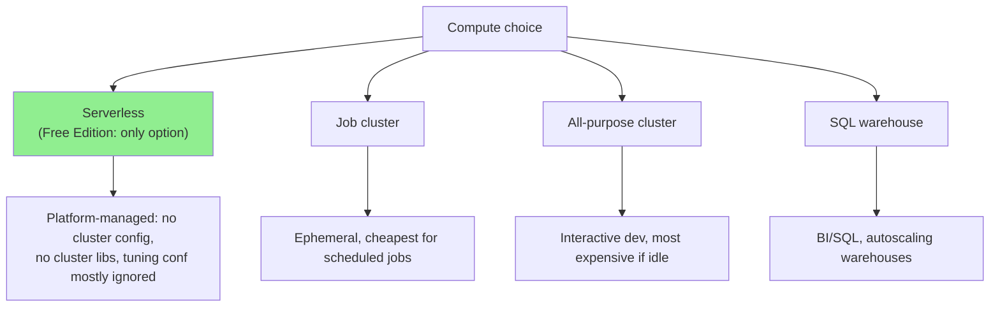
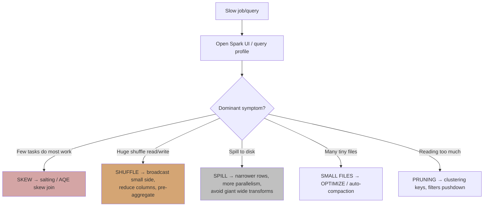
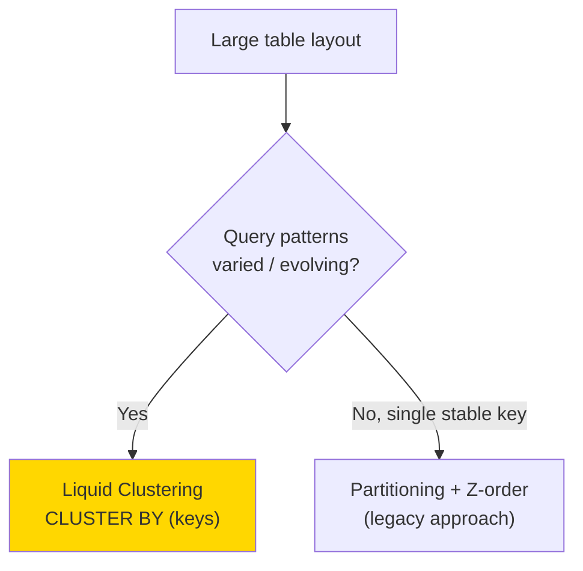
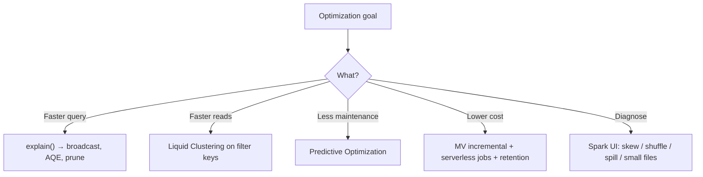

# Databricks Performance & Cost Optimization

## Overview

This skill covers **monitoring and optimizing cost and performance** of Databricks
processing environments — the corporate responsibility of improving operational
efficiency. It spans query/job tuning, physical data layout (clustering, compaction),
platform features (AQE, Predictive Optimization), and the reading of diagnostic signals
(Spark UI, event log, run history).

It also frames the **serverless vs classic** distinction that governs *which* knobs you
even have — critical on the Free Edition, which is serverless-only.

## When to Use This Skill

- **"My job/query is slow — where do I look?"** — diagnostic workflow (skew/shuffle/spill)
- **"How do I speed up a join?"** — broadcast vs shuffle joins, AQE
- **"How should I lay out a large table physically?"** — Liquid Clustering vs partitioning vs Z-order
- **"What tuning parameters matter and what do they control?"** — the core four
- **"How do I keep tables fast without manual OPTIMIZE?"** — Predictive Optimization
- **"How do I reduce cost?"** — DBU/storage cost levers by layer
- **"What's the difference between serverless and job/all-purpose/SQL warehouse compute?"** — compute model

## Compute Models (know what you control)



**Serverless implication:** most `spark.conf.set(...)` tuning calls are **no-ops or fail**
— the platform manages memory, shuffle partitions, and AQE. Optimize through **data
layout, query shape, and features (AQE/Predictive Optimization)**, not cluster knobs.

## Diagnostic Workflow



### Skew, shuffle, spill

- **Skew** — a few keys dominate a partition. AQE's skew-join handling splits them; for
  extreme cases, salt the key. Look for a long-tail task in the stage timeline.
- **Shuffle** — data movement across the network for joins/aggregations. Reduce by
  broadcasting the small side, projecting fewer columns, and pre-aggregating.
- **Spill** — partitions exceed memory and write to disk. Increase parallelism, narrow
  rows, avoid unnecessarily wide intermediate frames.

## Joins

```mermaid
graph LR
    A["Join two tables"] --> B{One side small<br/>(< broadcast threshold)?}
    B -->|Yes| C["BroadcastHashJoin<br/>(no shuffle)"]
    B -->|No| D["SortMergeJoin / shuffle<br/>(rely on AQE)"]

    style C fill:#87ceeb
```

Verify the plan with `explain()` — expect `BroadcastHashJoin` when broadcasting the small
side. AQE can convert a sort-merge join to broadcast at runtime based on actual sizes.

## Tuning Parameters (the core four)

Even where you cannot *set* them on serverless, you must know what they control:

| Parameter | Controls |
|-----------|----------|
| `spark.sql.shuffle.partitions` | Number of partitions after a shuffle (parallelism vs overhead) |
| `spark.sql.autoBroadcastJoinThreshold` | Max size for auto-broadcasting the small join side |
| `spark.sql.adaptive.enabled` (AQE) | Runtime re-optimization: coalesce partitions, skew join, join strategy switch |
| `spark.sql.files.maxPartitionBytes` | Target bytes per read partition (input parallelism) |

### Aggregation cost/precision

- `approx_count_distinct` (HyperLogLog) — fast, approximate; use for large-cardinality
  metrics where a small error is acceptable.
- `count(distinct ...)` — exact, expensive (full shuffle/dedup). Use when precision matters.
- `union` (by position) vs `unionByName` (by column name) — prefer `unionByName` to avoid
  silent column misalignment.

## Physical Layout



- **Liquid Clustering** — modern replacement for partitioning + Z-order; adapts to query
  patterns without rewrites, avoids the small-partition problem. Prefer it for new tables.
  ```sql
  ALTER TABLE workspace.bcb_gold.fato_sgs CLUSTER BY (codigo_serie, data_ref);
  ```
- **Partitioning** — coarse pruning on a stable low-cardinality column; over-partitioning
  causes tiny files.
- **OPTIMIZE / compaction** — coalesce small files (a common Bronze problem from streaming).

## Predictive Optimization

Databricks can automatically run `OPTIMIZE` and `VACUUM` and choose clustering for managed
UC tables — removing manual maintenance jobs. Enable it and let the platform decide when to
compact and clean up, rather than scheduling maintenance notebooks.

## Cost Levers by Layer

| Layer | Cost driver | Optimization |
|-------|-------------|--------------|
| **Bronze** | Storage volume, many small files | Retention policy, compaction, compression |
| **Silver** | Compute (joins/dedup) + storage | Clustering on join/dedup keys, pre-filter |
| **Gold** | Query cost on dashboards | Materialized Views (incremental refresh), denormalize |

General cost discipline:
- Prefer **Materialized Views** in Gold — incremental refresh beats recomputing aggregates.
- Prefer **serverless job compute** for scheduled work (no idle cost) over all-purpose.
- Read **run history + event log** to spot regressions (duration creep, growing shuffle).

## Common Mistakes

| Mistake | Impact | Fix |
|---------|--------|-----|
| Setting cluster tuning conf on serverless | No-op / error; false confidence | Optimize layout & query; trust AQE |
| Over-partitioning | Tiny files, slow reads | Liquid Clustering or coarser partitions |
| `count(distinct)` on huge data for a KPI | Expensive full shuffle | `approx_count_distinct` when approx is fine |
| Recomputing Gold aggregates from scratch | Wasted compute | Materialized View incremental refresh |
| Manual OPTIMIZE/VACUUM everywhere | Maintenance toil | Enable Predictive Optimization |
| Ignoring skew | One task stalls the stage | AQE skew join / salting |

## Quick Reference



## Version History

- **v1.0.0** — Compute models, diagnostic workflow (skew/shuffle/spill), joins & AQE,
  core tuning parameters, Liquid Clustering, Predictive Optimization, cost levers by layer.
